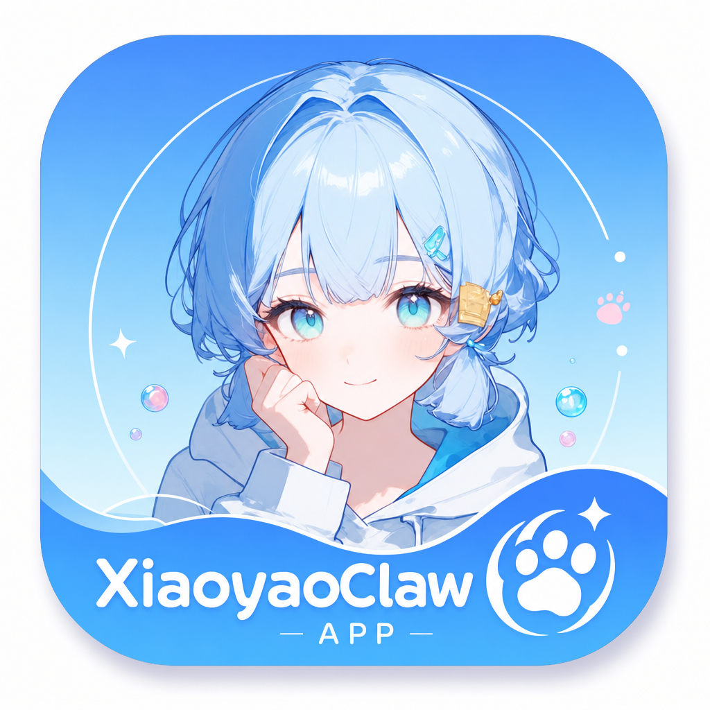
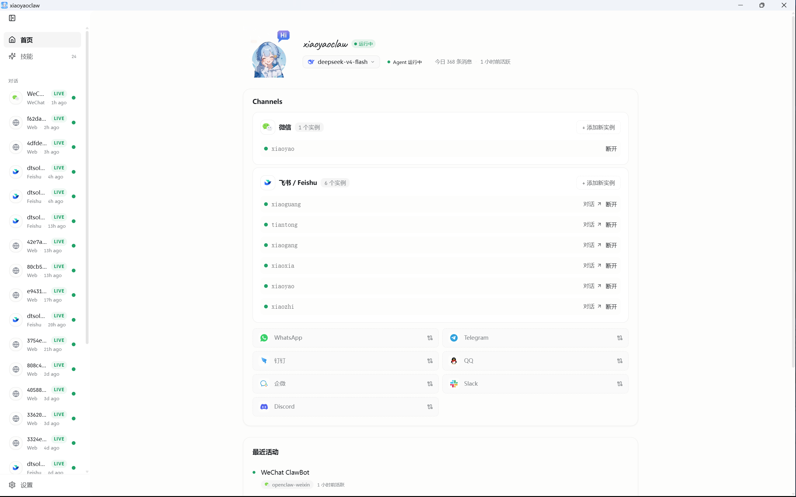
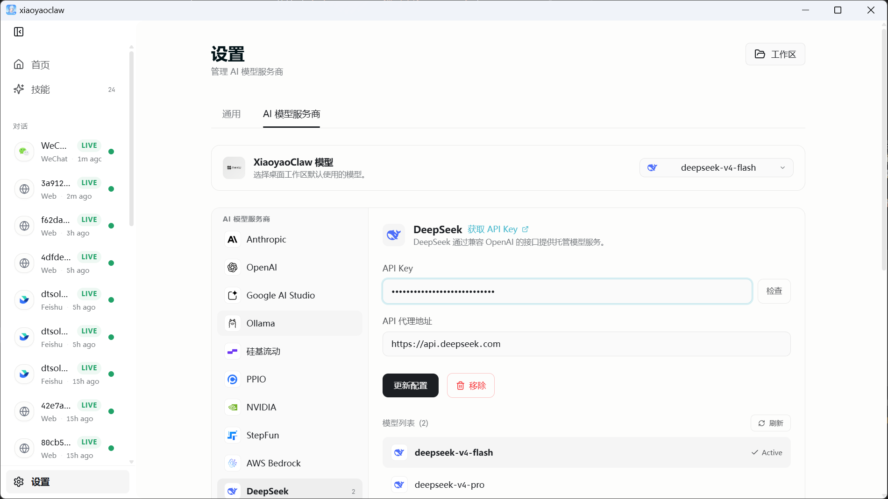
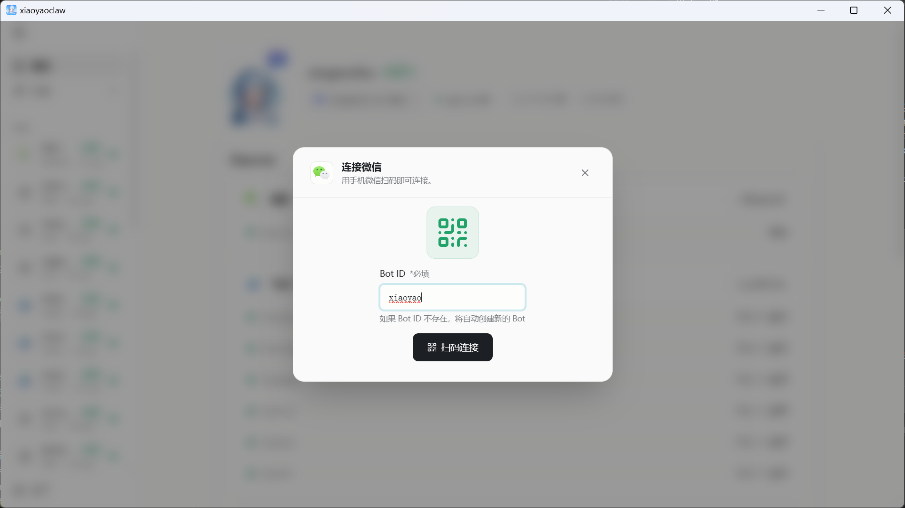
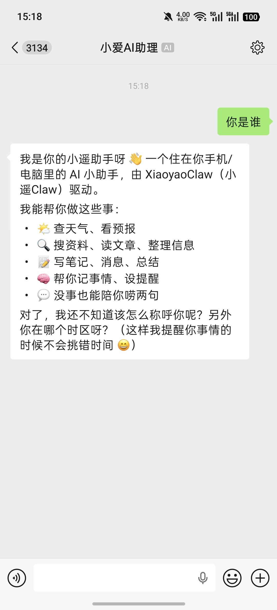
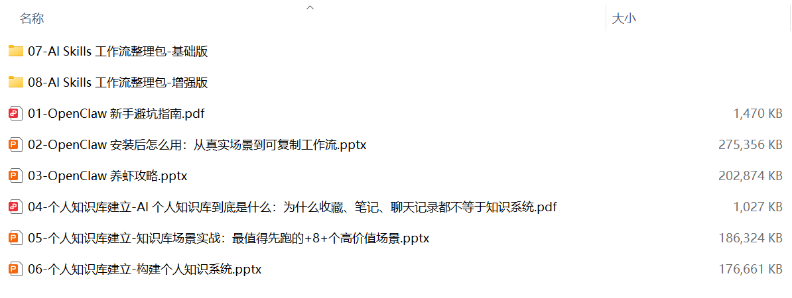
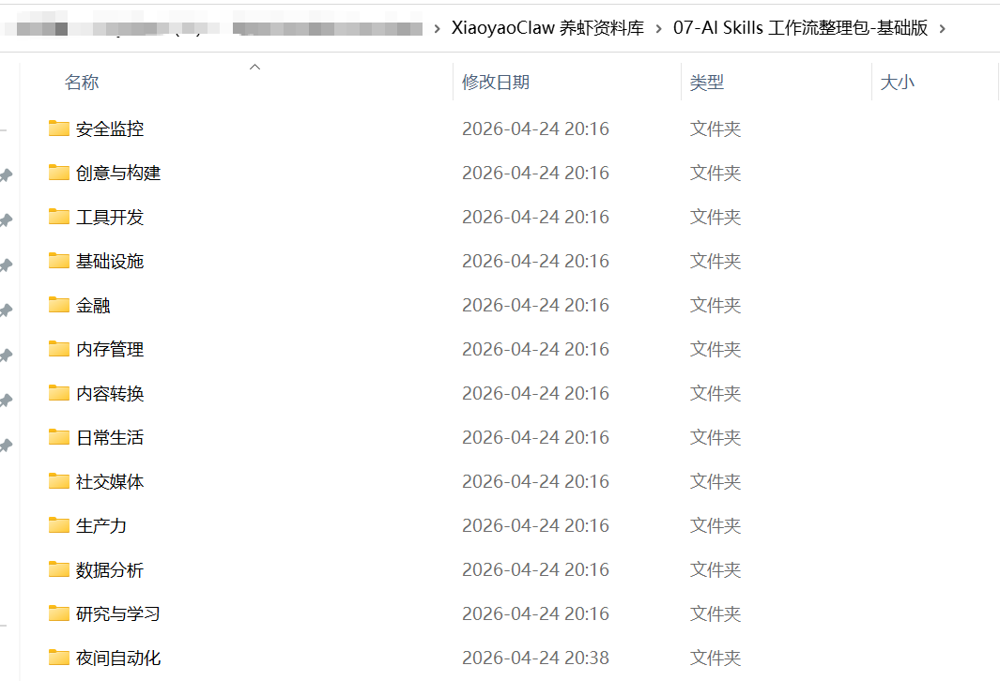
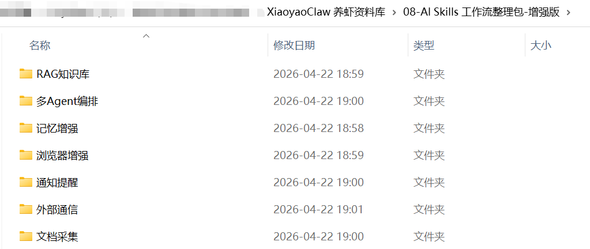

# XiaoyaoClaw · 产品介绍

---

## 产品介绍

**XiaoyaoClaw 是一款桌面优先的本地 AI 助手管理平台。**

把 AI 助手装进你自己的电脑——一份安装包、一个图标、一次扫码登录，就能把同一个 AI 助手同时部署到飞书、Slack、Discord、微信、Telegram、钉钉、QQ、企业微信、WhatsApp 等多个即时通讯平台，让它真的能读飞书表格、查日程、建任务、写 Issue，做你日常的 AI 助理。

### 我们的不同

| 其他 AI 助手工具 | XiaoyaoClaw |
|-----------------|-------------|
| 数据上传到云端，归别人管 | **本地优先**，配置、聊天记录、API 密钥都在你电脑里 |
| 每接一个平台都要单独登录、单独付订阅 | 一个 App 联通 9 大 IM，**一份订阅管所有** |
| 飞书只能挂一个应用，多团队要开多个账号 | **同平台多实例并行**，6 个飞书 Bot 同时跑 |
| AI 只会说话，做不了事 | 内置**技能中心**，AI 能读表格、查日历、建任务、写 Issue |
| 改个模型要去改配置文件 | 模型**热切换**，UI 里点一下就生效 |

> 上图是真实运行中的 XiaoyaoClaw 主控制台：左侧是对话与会话导航（24 个技能已加载），主区域显示当前 Bot 状态（`xiaoyaoclaw` / `deepseek-v4-flash` / 今日 368 条消息）、已连接的 1 个微信实例和 6 个飞书实例、以及最近活动流。

---

## 受众是谁

### 🧑‍💼 一人公司 / 独立开发者 / 创业者
核心痛点是**客户维护与获取**（多渠道客服、社群运营）+ **产品构建与交付**（需求跟踪、开发协作）。希望用同一个 AI 助手同时接入飞书 / Slack / 微信 / Discord 等所有客户渠道，又能协助处理 GitHub Issues 和 PR 草稿。这些**真实场景跑顺后，能沉淀为可复制的工作流**，下次遇到同类任务直接调用，把节省下来的时间投入产品本身。

### 🎨 内容创作者 / 自媒体团队
围绕**选题 → 内容创作 → 排期 → 多平台分发 → 数据回收**的全流程。希望 AI 在创作工具链里直接协作，把每个环节的重复操作自动化，让人专注创作本身。

### 📊 产品经理 / 互联网运营
日常工作以**重复流程**为主：PRD 起草、用户反馈归类、需求优先级讨论、报表汇总、活动数据复盘。希望 AI 在已经用的飞书 / 钉钉 / 企业微信里把这些跑起来，让人专注需求判断和策略。

### 💼 职场人士 / 效率型用户
**日常办公**（周报 / 邮件 / 日程 / 任务 / 文档）和**日常学习**（研报 / 论文 / 笔记）都想提速的普通上班族。希望 AI 在自己已经用的飞书 / 微信 / 钉钉 / 企业微信里直接当助理：周报一句话生成、研报自动要点提炼、跨 IM 搜历史消息，把日常的**收藏、笔记、聊天记录升级为可检索的知识系统**——下次需要时找得到。又不愿意为 AI 再学一个新工具，更不能让公司数据进 SaaS。

---

## 使用场景

### 场景一 · 一人公司的"全渠道客户进得来"
一个独立开发者的客户分散在飞书 / 微信 / Slack / Discord 四个平台。用 XiaoyaoClaw **创建一个 Bot、配上各渠道对应实例**，所有客户咨询汇总到主控台同一时间轴——不用切来切去，也不会漏接。

### 场景二 · 一人公司的"开发协作不丢"
维护 GitHub 仓库 + 飞书工作群。Bot 启用 **`gh-issues` + `coding-agent` 技能**——GitHub 上的 Issues 汇总到 Bot 控制台，AI 起 PR 描述草稿，开发人员只补实现要点。

### 场景三 · 内容创作者的"选题到分发一气呵成"
创作团队工作日。Bot 绑创作工作群 + 启用飞书协作技能组（**表格 / 日历 / 文档**）——**群里一句灵感 AI 自动整理进飞书表格的选题库、协助起草、初稿排期推到日历、发布后数据回收**到同一张表。让人专注创作本身。

### 场景四 · 产品经理 / 运营的"反馈归类 + 文档落地"
一个 PM 每天被十几个群的用户反馈轰炸，活动结束还要写复盘、起 PRD。Bot 接入产品反馈群 + 启用 **`deep-research` 技能**——反馈内容 AI 帮忙归类整理；活动结束 AI 起草复盘文档推到飞书；PRD 草稿 AI 起骨架，PM 只改判断部分。

### 场景五 · 职场人士的"杂事与学习都提速"
普通上班族的高频日常。Bot 绑 **飞书 + 企业微信 + 微信**：
- **日常办公**：周末一句话 AI 出周报（汇总飞书 / 邮件 / 群消息）；日程冲突提醒；任何时候跨 IM 搜一条历史消息。
- **日常学习**：读研报 / 论文让 AI 提炼要点；笔记自动归档。

---

## 快速上手（以微信为例）

只需要三步，就能完成从打开 App 到与 AI 助手对话的全流程。

### 第一步：添加模型

进入桌面 App **设置 → AI 模型服务商**，选择一个 AI 提供商并填入 API Key。这里以 **DeepSeek** 为例——填好 Key 后，把默认模型切到 `deepseek-v4-flash`：

### 第二步：添加微信渠道

回到首页，在 Channels 区为「微信」新建一个实例，弹出扫码连接对话框。填入 Bot ID（如 `xiaoyao`，不存在时会自动创建），用手机微信扫码即可：

### 第三步：跟 AI 助手对话

打开手机微信，给刚才绑定的 Bot 发消息，就能在微信里直接收到 AI 助手的回复——AI 会自我介绍"由 XiaoyaoClaw（小遥Claw）驱动"：

> ✅ **AI 助手搭建完成**。后续接入飞书 / Slack / Discord 等其他渠道的流程是一样的：选渠道 → 扫码 → 对话。

---

## 更多场景，一键可复制

上面 3 步只演示了**微信对接**这一条路径。XiaoyaoClaw + 养虾资料库还内置了 **8+ 个开箱即用的高价值场景**——客户响应 / 开发协作 / 内容创作 / 知识沉淀 / 办公提速 / 学习消化，挑一个先跑起来，跑顺后再扩展。

---

## CTA · 现在就试试

所有平台的安装包统一在百度网盘分发：

- **链接**：<https://pan.baidu.com/s/1lDaWjMCRXIT-Sqx9UFjerg?pwd=37ed>
- **提取码**：`37ed`

### 怎么选安装包

进入网盘后根据自己的设备下载对应文件，文件名格式如下：

| 设备 | 文件名格式 | 示例 |
|------|-----------|------|
| macOS · Apple Silicon（M 系列芯片） | `XiaoyaoClaw-{版本号}-arm64.dmg` | `XiaoyaoClaw-1.0.11-arm64.dmg` |
| macOS · Intel 芯片 | `XiaoyaoClaw-{版本号}-x64.dmg` | `XiaoyaoClaw-1.0.11-x64.dmg` |
| Windows · 10/11 x64 | `XiaoyaoClaw-Setup-{版本号}.exe` | `XiaoyaoClaw-Setup-1.0.11.exe` |

> 💡 **怎么判断你的 Mac 是哪种芯片**：点左上角  → "关于本机" → 看"芯片"一行——`Apple M1/M2/M3/...` 就是 Apple Silicon，`Intel` 开头就是 Intel 芯片。

### 安装与首次登录

1. 下载完成后**双击安装包**（macOS 是 `.dmg`，Windows 是 `.exe`）。
2. 安装完成后首次启动会要求登录——直接注册账号即可：

   - **注册地址**：<https://cas.xiaoyaosai.com/signup/xiaoyaoclaw>
   - ⚠️ 注册需要**邀请码**，可通过任一方式获取：
     - 购买邀请码：<https://www.landoo.me/item/7>
     - 加微信 `dtsola`（备注：`xiaoyaoclaw`）

3. **成为付费用户后，享受以下权益——一次性买断**（不是订阅、不续费、不再扣费）：

   🎁 **「养虾资料库」完整教程包**——OpenClaw 新手避坑指南 / 安装后怎么用 / 养虾攻略，个人知识库建立系列（3 份），AI Skills 工作流整理包（基础版 + 增强版），共 8 份：

   

   **AI Skills 工作流整理包 · 基础版**（13 个分类工作流包）：

   

   **AI Skills 工作流整理包 · 增强版**（7 个高级工作流包）：

   

   > 📬 **怎么领取养虾资料库**：完成付费后，加微信 `dtsola`，**微信内发送你的 `邀请码订单号`**（同时备注 `xiaoyaoclaw`），即可领取以上 8 份资料 + Skills 基础版/增强版全套工作流。

   💬 **加入【小遥 AI 用户交流群】**——一对一答疑、产品更新优先推送、新技能首发体验（群码见下方）。

---

### 用户交流和反馈群

扫码加入【小遥 AI · 用户交流群】——产品反馈、使用交流、功能建议（用户专属）。

